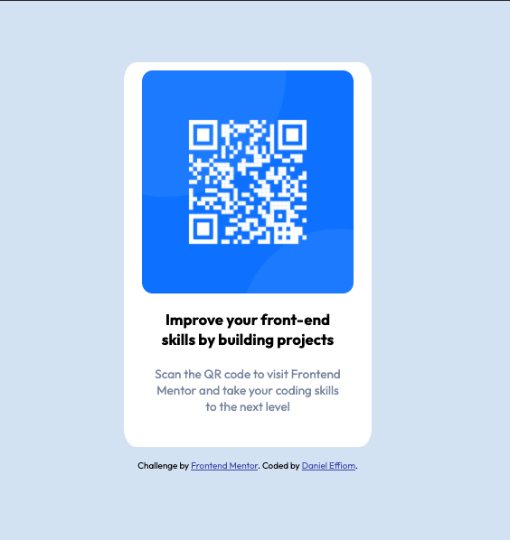

# Frontend Mentor - QR code component

## Welcome! 👋

Worked on the QR-code component challenge on Frontend Mentor. This was very existing and my first front-end coding challenge.

[Frontend Mentor](https://www.frontendmentor.io) challenges help you improve your coding skills by building realistic projects.

**To do this challenge, a basic understanding of HTML and CSS was required.**

## Table of contents

- [Overview](#overview)
  - [The challenge](#the-challenge)
  - [Screenshot](#screenshot)
  - [Links](#links)
- [My process](#my-process)
  - [Built with](#built-with)
  - [What I learned](#what-i-learned)
  - [Continued development](#continued-development)
  - [Useful resources](#useful-resources)
- [Author](#author)
- [Acknowledgments](#acknowledgments)

## Overview
### The challenge

The challenge was to build out a QR code component and get it looking as close to the mobile and desktop design in the starter kit provided.

### Screenshot



### Links

- Solution URL: [https://www.frontendmentor.io/solutions/qr-code-component-9WAn0C5aOM]
- Live Site URL: [https://danie0812.github.io/QR-code-component/]

## My process

### Built with

- Semantic HTML5 markup
- CSS custom properties
- Mobile-first workflow
- [Styled Components](https://styled-components.com/) - For styles

### What I learned
- Using a level-one heading (h1) even though it wasn't a full-page challenge. I  created an h1 element within the main element that was hidden visually but visible and readable by screen readers. The class sr-only hid the content visually.

- Don't skip heading levels; Always start from h1, followed by h2, and so on up to h6 (h1,h2,...,h6). 

- If the image is not a decoration like in the case of this project, it must have an alt attribute. The alt attribute should explain its purpose.

- Instead of using pixels in font-size, used relative units (em or rem). The font-size in absolute units like pixels does not scale with the user's browser settings. This can cause accessibility issues for users who have set their browser to use a larger font size. More about this [here](https://www.joshwcomeau.com/css/surprising-truth-about-pixels-and-accessibility/)

Code snippets:

```html
<h1 class="sr-only">QR Card Component</h1>
```
```css
.sr-only:not(:focus):not(:active) {
    clip: rect(0 0 0 0); 
    clip-path: inset(50%);
    height: 1px;
    overflow: hidden;
    position: absolute;
    white-space: nowrap; 
    width: 1px;
}
```
### Continued development

Use this section to outline areas that you want to continue focusing on in future projects. These could be concepts you're still not completely comfortable with or techniques you found useful that you want to refine and perfect.

- Responsive Web Design
- Web accessibility

### Useful resources

- [Example resource 1](https://www.example.com) - This helped me for XYZ reason. I really liked this pattern and will use it going forward.
- [Example resource 2](https://www.example.com) - This is an amazing article which helped me finally understand XYZ. I'd recommend it to anyone still learning this concept.

**Note: Delete this note and replace the list above with resources that helped you during the challenge. These could come in handy for anyone viewing your solution or for yourself when you look back on this project in the future.**

## Author

- Website - [Add your name here](https://www.your-site.com)
- Frontend Mentor - [@yourusername](https://www.frontendmentor.io/profile/yourusername)
- Twitter - [@yourusername](https://www.twitter.com/yourusername)

**Note: Delete this note and add/remove/edit lines above based on what links you'd like to share.**

## Acknowledgments

This is where you can give a hat tip to anyone who helped you out on this project. Perhaps you worked in a team or got some inspiration from someone else's solution. This is the perfect place to give them some credit.

Melvin Aguilar 🧑🏻‍💻
@MelvinAguilar

El Salvador

**Note: Delete this note and edit this section's content as necessary. If you completed this challenge by yourself, feel free to delete this section entirely.**
